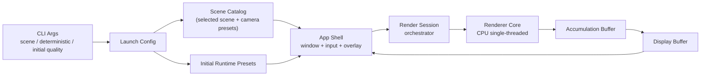
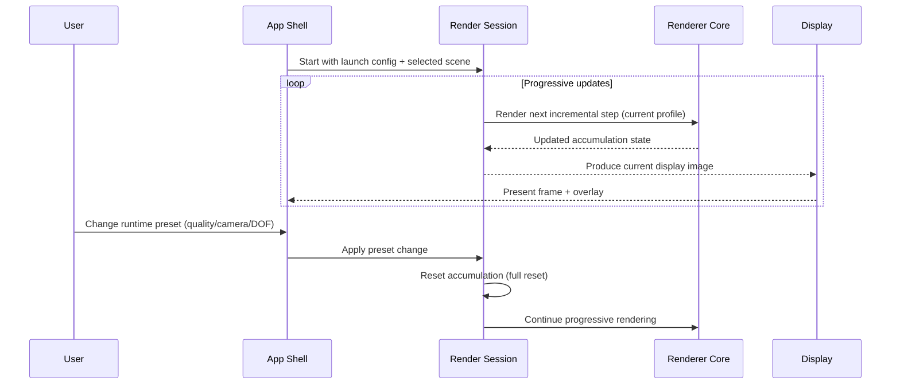
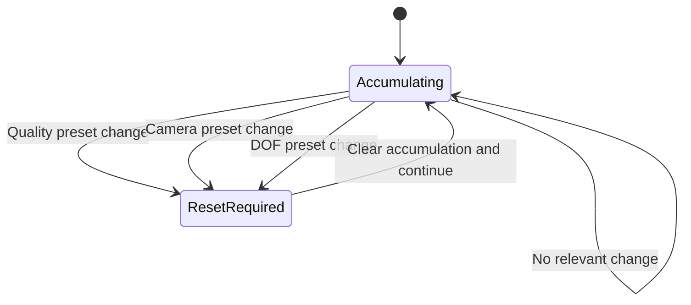
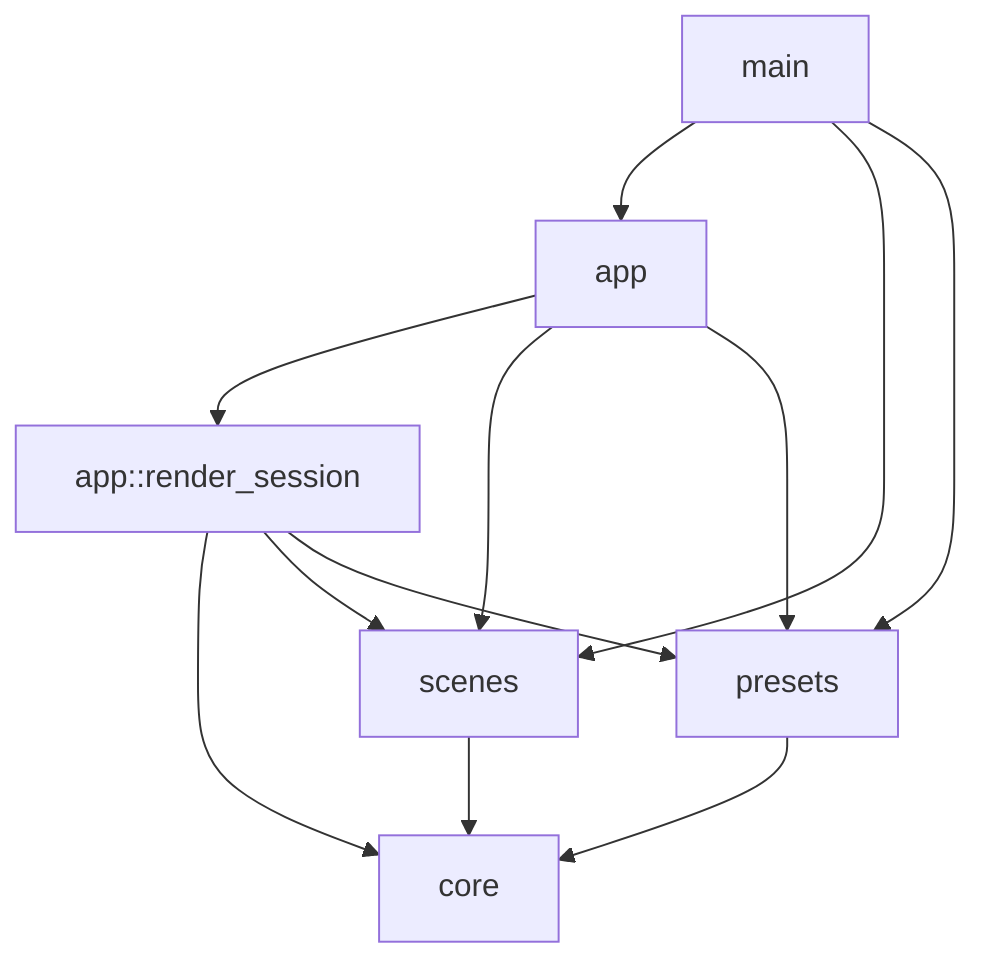

# Phase 1 Design Document
## Project: `raytracer-adventure-lab`
## Phase: Phase 1 (Sebastian Lague - "Coding Adventure: Ray Tracing")
## Platform: macOS
## Language Goal: Rust (learning-first)
## Version: 1.0

### 1. Purpose of This Document

This document defines the Phase 1 system design for the project.

It describes:
- architecture and module boundaries
- runtime flow and state flow
- dependency choices and dependency policy
- file/folder organization
- reset behavior for progressive rendering
- verification and artifact organization rules

It does not include:
- code
- line-by-line algorithms
- implementation instructions

This is a design document only.

### 2. Phase 1 Design Scope (What This Design Covers)

Phase 1 is a **windowed progressive preview app** that reproduces the first Sebastian Lague ray tracing video at a learning level.

The design is optimized for:
- Rust learning
- visible results
- fast completion

The design intentionally accepts that some refactoring may happen in later phases.

### 3. Design Drivers (What This Design Optimizes For)

Primary priorities for Phase 1:
1. Rust learning
2. visual results
3. fast completion

Secondary priorities:
- clean architecture (but not over-architecture)
- future extensibility to later phases

Non-priorities in Phase 1:
- maximum performance
- multithreading
- GPU-first architecture
- polished UI

### 4. Selected Architecture Decisions (Summary)

- Rust project, learning-first
- CPU-first renderer
- single-threaded implementation in Phase 1
- one binary crate with internal modules (no multi-crate workspace yet)
- windowed progressive preview app
- fixed-size non-resizable window (`1280x720` target)
- scene selected before launch (CLI)
- runtime controls only for presets:
  - quality profile
  - camera preset (per scene)
  - DOF preset (global preset override)
- keyboard-based controls with overlay hints (no widget UI)
- automatic full accumulation reset on any runtime preset change
- deterministic mode available at launch time (for debugging/comparison)
- 3 official demo scenes for acceptance
- no in-app image export in Phase 1 (macOS screenshots/clips are used)

### 5. Core Design Principle (Most Important)

The main design split is:
- **rendering domain state**
- **app/runtime interaction state**

This split is more important than any internal math or shading split in Phase 1.

Why:
- progressive rendering depends on clear accumulation validity rules
- UI/runtime controls should not leak into the renderer core
- this creates a clean seam for Phase 2 threading and performance work

### 6. System Architecture (High Level)



#### 6.1 Component Roles

- `CLI / Launch Config`: reproducible startup configuration
- `Scene Catalog`: official demo scenes and per-scene camera presets
- `App Shell`: window, keyboard input, overlay, display loop
- `Render Session`: runtime preset state, reset decisions, progressive orchestration
- `Renderer Core`: ray/path tracing domain logic only
- `Accumulation Buffer`: progressive accumulation state and counters
- `Display Buffer`: current image prepared for preview display

### 7. Runtime Flow (Progressive Preview Behavior)



### 8. Launch-Time vs Runtime Controls

#### 8.1 Launch-Time Controls (CLI)

Launch-time controls are chosen before the preview window starts.

Required launch-time controls:
- scene selection (default scene with override)
- deterministic mode on/off
- initial quality profile (optional override)

Optional launch-time development control:
- temporary dev resolution fallback (`960x540`) when `1280x720` is too slow for iteration

#### 8.2 Runtime Controls (Keyboard-Based)

Runtime controls are limited to preset changes only:
- quality profile (`Draft`, `Preview`, `Quality`)
- camera preset (from the selected scene)
- DOF preset (`Off`, `Subtle`, `Strong`)

Runtime controls are intentionally limited to keep the app simple and protect scope.

### 9. Progressive Accumulation Reset Policy

This policy is a core Phase 1 design rule.

Any runtime preset change triggers a **full accumulation reset**.



#### 9.1 Reset Rules Table

| Change | When | Reset Accumulation | Restart Required | Notes |
|---|---|---:|---:|---|
| Quality profile change | Runtime | Yes | No | Full render profile changes |
| Camera preset change | Runtime | Yes | No | Camera rays change |
| DOF preset change | Runtime | Yes | No | Camera sampling changes |
| Scene selection change | Launch | N/A | Yes | Scene is launch-time only |
| Deterministic mode change | Launch | N/A | Yes | Launch-time behavior only |
| Window resize | Not supported | N/A | N/A | Fixed-size Phase 1 window |

### 10. Data and State Model (Design-Level)

This section defines state ownership, not implementation details.

#### 10.1 Launch Configuration (Startup-Owned)

Contains:
- selected scene id
- deterministic mode flag
- initial quality profile
- resolution selection (default `1280x720`, optional dev fallback)

Owned by:
- startup / CLI handling

#### 10.2 Scene Definition (Static During Run)

Contains:
- geometry
- materials
- lighting/emissive setup
- per-scene camera presets
- scene metadata (id/name)

Owned by:
- scene catalog + renderer domain

#### 10.3 Runtime Preset State (Mutable During Run)

Contains:
- active quality profile
- active camera preset index/name
- active DOF preset

Owned by:
- app shell / render session

#### 10.4 Render Session State

Contains:
- accumulation validity status
- accumulation counters (for overlay/progress)
- accumulation buffer
- display buffer
- derived active render profile

Owned by:
- render session orchestrator

#### 10.5 View / Overlay State

Contains:
- overlay text content (scene, presets, sample count, deterministic mode)

Owned by:
- app shell

### 11. Module Organization and Responsibility Boundaries

Phase 1 uses **one binary crate** with layered internal modules.

#### 11.1 Boundary Rule (Critical)

- `core` must not depend on `app`
- `app` may depend on `core`, `scenes`, and `presets`
- `scenes` and `presets` may depend on `core` domain types
- `render_session` acts as the adapter between app events and renderer behavior



#### 11.2 Logical Module Responsibilities

`app` layer responsibilities:
- CLI parsing and launch config
- window lifecycle and keyboard input
- overlay display
- runtime preset interaction
- render loop orchestration through `render_session`

`render_session` responsibilities:
- own current runtime preset selections
- build active render profile from presets
- detect changes that require accumulation reset
- reset accumulation when required
- request incremental rendering from core
- expose status for overlay

`core` layer responsibilities:
- rendering domain concepts and behavior
- camera ray generation
- geometry intersection behavior
- material/light behavior
- sampling behavior
- accumulation and image-buffer domain logic

`scenes` responsibilities:
- official scene catalog
- scene creation and metadata
- per-scene camera presets

`presets` responsibilities:
- quality profile definitions (`Draft`, `Preview`, `Quality`)
- DOF preset definitions (`Off`, `Subtle`, `Strong`)

### 12. Dependency Policy and Recommended Dependencies

#### 12.1 Policy

Use dependencies for plumbing, not for the ray tracing learning core.

This means:
- practical crates are allowed for windowing, CLI parsing, RNG, and app plumbing
- renderer core logic remains self-written
- dependencies should not leak into the core architecture without a clear reason

#### 12.2 Recommended Dependency Choices (Phase 1)

Window + presentation (app layer):
- **Default:** `minifb`
- **Fallback if macOS friction occurs:** `winit + pixels`

CLI parsing:
- `clap`

Randomness / deterministic mode support:
- `rand`
- explicit deterministic RNG crate (for example `rand_chacha`)

Error handling:
- simple fail-fast policy
- app-level convenience error handling crate is allowed (for example `anyhow`)

Logging/diagnostics:
- no logging crate required initially
- use overlay + terminal startup summary

Math (core layer):
- minimal self-written math module in Phase 1
- fallback to a small math crate only if progress is blocked

No Phase 1 dependency is planned for:
- image export
- scene file parsing/serialization
- UI widget toolkit

### 13. Technical Conventions (Design-Level)

These conventions reduce confusion and make later phases easier.

#### 13.1 Numeric Precision
- Phase 1 uses `f32` as the default numeric precision for rendering math.

Reason:
- good enough for Phase 1 scenes
- simpler and more typical for graphics work
- supports faster iteration

#### 13.2 Color Pipeline Policy
- Accumulation uses linear color values.
- Display output uses a simple display conversion policy before preview presentation.
- Advanced color management is out of scope for Phase 1.

Reason:
- keeps visuals understandable and consistent
- avoids common "why does it look wrong" confusion during debugging

#### 13.3 World / Camera Convention
- Use one consistent documented world convention for all Phase 1 scenes.
- Recommended default convention:
  - right-handed world
  - `Y` as world up
  - camera presets defined consistently per scene
- Units are arbitrary but must remain consistent inside a scene.

Reason:
- consistency matters more than the exact convention choice in Phase 1

#### 13.4 Deterministic Mode Contract
- Deterministic mode is selected at launch time.
- Same scene + same presets + same quality + deterministic mode on should produce repeatable comparison behavior on the same machine/build.
- Deterministic mode is primarily for debugging and acceptance captures.
- Phase 1 does not promise cross-platform bit-identical output.

### 14. Window and Runtime UX Policy (Phase 1)

- Fixed-size non-resizable window
- Target preview resolution: `1280x720`
- Development fallback allowed: `960x540` when iteration speed is too slow
- Final acceptance captures should use `1280x720`
- Keyboard-based controls only (no widget UI)
- Status overlay is always visible in Phase 1

#### 14.1 Overlay Content (Recommended Minimum)

Overlay should display:
- scene name
- camera preset name
- DOF preset name
- quality profile name
- deterministic mode (on/off)
- accumulation/sample progress indicator

### 15. Official Demo Scene Design (Phase 1)

Phase 1 has exactly 3 official demo scenes. They are first-class design artifacts, not ad-hoc examples.

Recommended official scene set:

1. **Materials and Lighting Showcase**
- primary coverage scene for spheres, material variation, emissive/lighting behavior, sky/background, progressive refinement

2. **Mixed Geometry Validation**
- proves triangle support and mixed geometry behavior under the same renderer pipeline

3. **Camera and DOF Study (Deterministic Benchmark)**
- proves camera preset switching, DOF preset behavior, and deterministic quality comparisons

These scenes should collectively cover the Phase 1 requirements.

### 16. Repository and File/Folder Organization

This project is organized as:
- source code by technical layers
- docs/captures/checklists by phase

Recommended Phase 1 structure:

```text
raytracer-adventure-lab/
├── docs/
│   └── phase-1/
│       ├── requirements-spec.md
│       ├── design.md
│       ├── checklist.md
│       ├── retrospective.md
│       └── implementation-guide.md
├── captures/
│   └── phase-1/
│       ├── official/
│       └── work/
├── notes/
│   ├── dev-log.md
│   └── backlog.md
├── src/
│   ├── main.rs
│   ├── app/
│   │   ├── mod.rs
│   │   ├── cli.rs
│   │   ├── shell.rs
│   │   ├── runtime_state.rs
│   │   ├── render_session.rs
│   │   ├── reset_policy.rs
│   │   └── overlay.rs
│   ├── core/
│   │   ├── mod.rs
│   │   ├── math.rs
│   │   ├── camera.rs
│   │   ├── scene.rs
│   │   ├── geometry.rs
│   │   ├── material.rs
│   │   ├── renderer.rs
│   │   ├── sampling.rs
│   │   ├── accumulation.rs
│   │   └── image_buffer.rs
│   ├── scenes/
│   │   ├── mod.rs
│   │   ├── catalog.rs
│   │   ├── materials_lighting_showcase.rs
│   │   ├── mixed_geometry_validation.rs
│   │   └── camera_dof_study.rs
│   └── presets/
│       ├── mod.rs
│       ├── quality_profiles.rs
│       └── dof_presets.rs
└── README.md
```

This is a design target, not a rigid requirement. Minor naming differences are acceptable if boundaries remain the same.

### 17. Error Handling and Observability Policy

#### 17.1 Error Handling (Phase 1)
- Fail fast on invalid startup inputs (unknown scene/preset/launch option)
- Print clear error messages to terminal
- Do not build recovery UI for startup errors in Phase 1
- Keep runtime controls preset-based to reduce invalid states

#### 17.2 Observability (Phase 1)
- Always-visible status overlay in preview window
- Terminal startup summary for launch configuration
- Manual screenshots/clips as verification evidence

These choices keep the app simple while making debugging easier.

### 18. Scope Control and Sandbox Experiment Lane

Phase 1 uses a strict scope policy with one sandbox lane.

Rules:
- only one sandbox experiment at a time
- sandbox work is time-boxed
- sandbox items are marked as non-official
- sandbox work must not block official demo scenes or Phase 1 DoD
- successful sandbox ideas go to backlog for later phases unless they are needed for Phase 1 acceptance

This preserves momentum while keeping the project fun.

### 19. Design Risks and Mitigations

#### Risk 1: Window/UI scope grows too much
Mitigation:
- keyboard-only controls
- no runtime scene switching
- no widget UI
- no in-app capture/export

#### Risk 2: CPU preview feels slow at `1280x720`
Mitigation:
- fixed quality profiles (`Draft`, `Preview`, `Quality`)
- dev fallback resolution (`960x540`)
- progressive preview with incremental steps

#### Risk 3: Beginner Rust complexity slows progress
Mitigation:
- single binary crate
- internal module boundaries only
- single-threaded Phase 1 implementation
- avoid over-abstracted APIs

#### Risk 4: Graphics bugs are hard to isolate
Mitigation:
- deterministic mode for comparison
- 3 official demo scenes with stable presets
- always-visible overlay with current state

### 20. Phase 1 Design Definition of Done

The Phase 1 design is complete when:
- system boundaries are clearly defined (`app`, `render_session`, `core`, `scenes`, `presets`)
- launch-time vs runtime controls are defined
- accumulation reset policy is explicit
- dependency policy and recommended dependency choices are documented
- file/folder organization is documented
- official demo scenes and acceptance intent are documented
- deterministic mode contract is documented
- non-goals and scope controls are documented
- implementation can begin without needing architecture decisions from coding-time guesswork

### 21. Implementation Handoff (What This Design Enables)

This design is intended to let the developer start coding without getting lost.

It gives a clear answer to:
- where code belongs
- what state changes require reset
- what UI exists in Phase 1
- what is intentionally deferred to later phases

Coding should follow this design while keeping the Phase 1 rule unchanged:
- all implementation code is written by the developer
